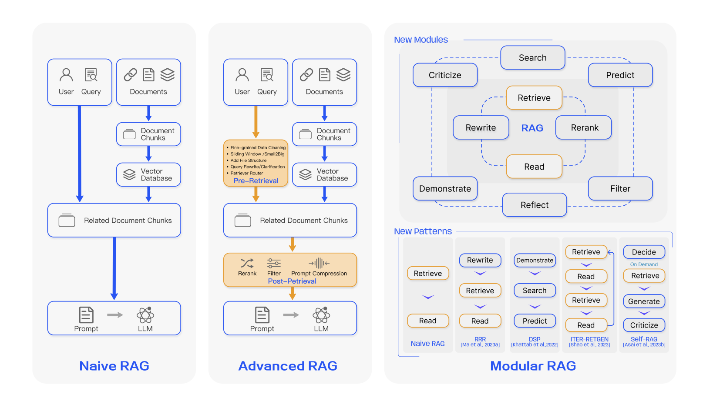
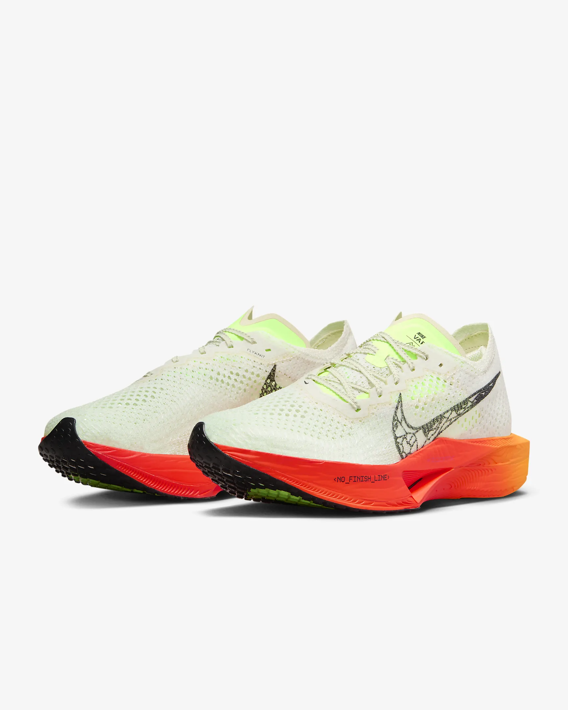
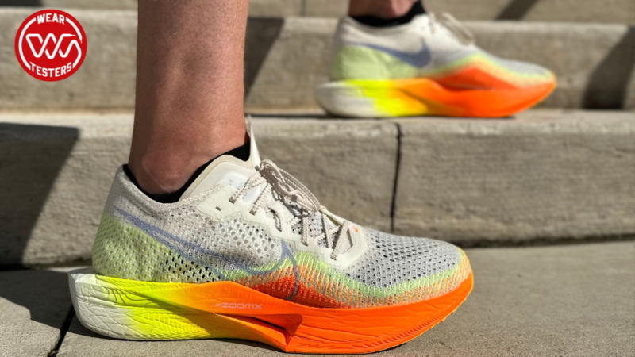
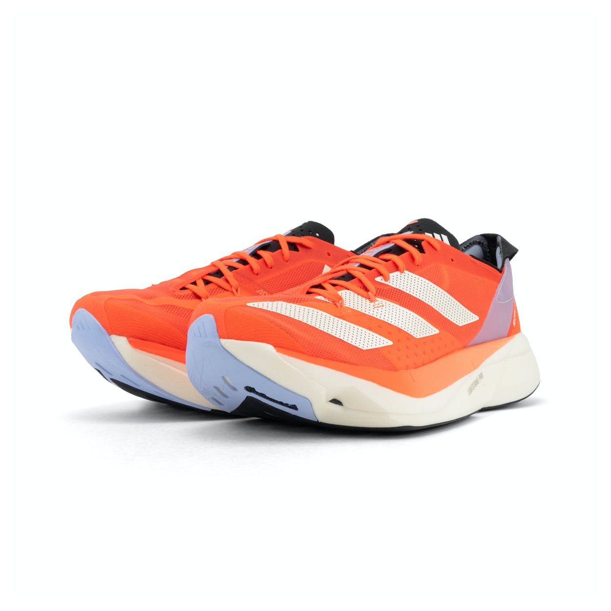
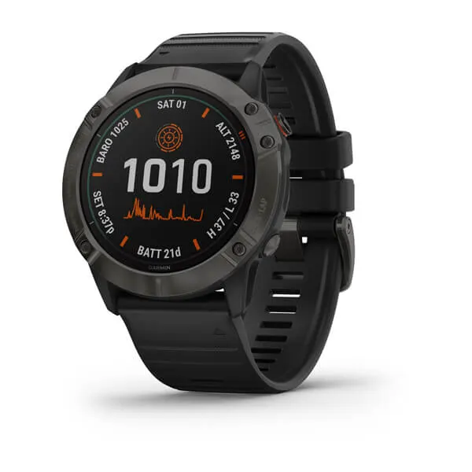
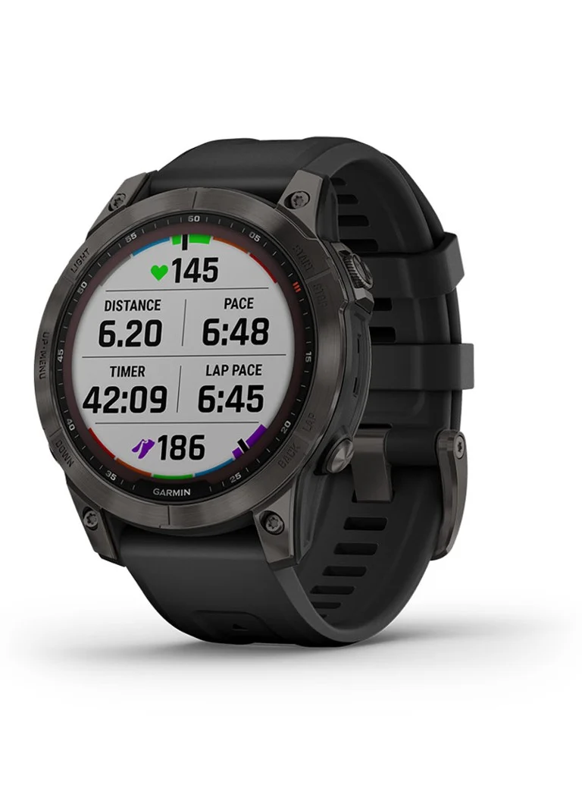

# GPT 4 Vision preview
As can be read in the [Azure OpenAI - Whats new of December 2023](https://learn.microsoft.com/en-us/azure/ai-services/openai/whats-new#gpt-4-turbo-with-vision-now-available) GPT-4 with Vision preview is out in public preview. I created a resource in the Azure region: `SwitzerlandNorth` since thats the only region next to `West US` that are able to host the GPT-4 Vision preview models.

One has to create a model deployment inside the Azure OpenAI service from a `gpt-4` model with verison `vision-preview`. If its not enlisted in the available models you either do not have preview access or you have created an Azure OpenAI service within the wrong region. Check here for model availability:
https://learn.microsoft.com/en-us/azure/ai-services/openai/concepts/models#gpt-4-and-gpt-4-turbo-preview-model-availability

# Examples
## Describe a picture
**Input**

`Describe this picture in great detail:`


**Output**

```The image depicts three visual diagrams, presumably representing the workflow of a Retriever-Reader-Generator (RAG) machine learning model in different advanced stages. The models are labeled as "Naive RAG," "Advanced RAG," and "Modular RAG," each showing a progression in complexity and functionality.

In the "Naive RAG" diagram on the left, there are three main components at the top horizontally aligned: "User," "Query," and "Documents." These feed into "Document Chunks," which then proceed to a "Vector Database." The output from this stage is "Related Document Chunks" which culminates in a "Prompt" to a Language Model (LLM) symbolized with a molecule-like icon.

The "Advanced RAG" diagram in the center follows a similar flow but includes additional steps and modifications, such as "Fine-grained Data Cleaning," "Sliding Window / Small2Big," adding "File Structure," and "Query Rewrite/Clarification." These steps lead to a stage called "Pre-Retrieval." The flow then proceeds similarly to the "Naive RAG" but adds the "Post-Retrieval" process which incorporates "Rerank," "Filter," and "Prompt Compression" before reaching the Language Model.

The diagram on the right represents "Modular RAG" and is divided into two sections: "New Modules" and "New Patterns." The "New Modules" section includes a workflow starting with "Search" and "Predict" then moves to "Retrieve," which connects to "RAG," "Rewrite," "Read," "Rerank," and includes additional actions such as "Criticize," "Demonstrate," "Reflect," and "Filter."

The "New Patterns" segment showcases four patterns of module combinations, such as "Rewrite," "Retrieve," "Read," and others in different configurations, each labelled with references like "RRR," "DSP," "ITER-RETGEN," and "Self-RAG," signifying different methods or studies associated with each pattern.

Each module is represented in a rectangular or rounded container with icons that symbolize its function, such as a magnifying glass for "Search," a pencil for "Rewrite," or a book for "Read." The diagrams feature connecting arrows that define the workflow and the steps that the data takes through the system. Additionally, some subtle visual enhancements like dashed borders enclosing related processes and directional arrows show the flow or sequence of operations. Overall, the picture is designed with a clean and structured layout, using shades of blue and orange to denote different parts of the process.
```

## Compare products

**Input**

```You are an ecommerce assistant that helps with deduplication of our assortment. Give a confidence score between 0 and 1 that indicates how confident you are that both images depict the same product. **Return only the score do not elaborate.** If you are unable to process the input return 0.```

**Output**

| Product 1  | Product 2  | Score |
|------------|------------|-------|
|||✅ 1|
|||✅ 0|
|||❌ 1 or 0.9|

* Ran the Fenix 6 against the Fenix 7 multiple times and results kept giving 1.0, 1 or 0.9.
  * Also added the following line to the prompt but it didn't help: `Compare closely because differences between product versions can be small.`
  * Reduced the temperature to 0 but that didn't help either.
  * Lastly tried to add the following line to the system prompt but it didn't help either: `New iterations of the same product do not count as the same product.`

# Comments
Sample API calls can be found here, make sure to use the latest API version.
https://learn.microsoft.com/en-us/azure/ai-services/openai/reference#chat-completions

Performance can be quite bad, sending two images for comparison can take up to 1 minute.
